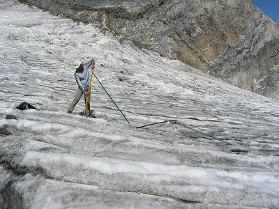

# Contexte et objectifs

{: .float-end.rounded.shadow.mw-100.mb-4}

A l’aube du 21ème siècle, les glaciers des Pyrénées françaises souffraient d’une méconnaissance importante (effectifs, localisations, caractéristiques). En effet, ils n’avaient pas connu d’observations d’ensemble depuis la fin des années 1980. Tandis que sur le versant espagnol, ils font l’objet d’un suivi annuel régulier et l’on connaît précisément leurs évolutions.

Créée en 2001, L’association « Moraine » est l’Observatoire des Glaciers des Pyrénées françaises. Elle a donc pour objectif de suivre annuellement leur évolution (longueur, surface, volume). Une collaboration étroite avec les glaciologues espagnols permet d’avoir des informations complètes à l’échelle de la chaîne. De plus, l’objectif est de diffuser largement les connaissances sur le sujet grâce à différents moyens de communication (internet, conférences, livre, exposition, médias).

 
{: .clearfix }

# Activités diversifiées

## Études Scientifiques

{: .float-end.rounded.shadow.mw-100.mb-4}

* Recherches bibliographiques (articles, ouvrages, photographies, cartes…) en vue de synthétiser les observations anciennes et de constituer un fond documentaire spécialisé.
* Campagnes d’observations et de mesures glaciologiques : variations de volume, évolutions des surfaces, fluctuations des fronts, vitesses d’écoulement, modifications morphologiques, reconstitutions d’évolutions anciennes…
* Rédaction de rapports techniques à partir des travaux de terrain, et participation à des colloques scientifiques.

 
{: .clearfix }

## Diffusion des connaissances

{: .float-end.rounded.shadow.mw-100.mb-4}

* Site Internet pour présenter l’association avec ses objectifs et ses activités, ainsi que des informations sur les glaciers pyrénéens.

* Conférences – diaporamas pour visiter, le temps d’une soirée, les principaux glaciers des Pyrénées et entrevoir les originalités de chacun.

* Sorties thématiques pour côtoyer, lors d’une excursion d’une journée, un glacier facile d’accès.

* Documents divers de présentation des glaciers (articles, bulletins, brochures, panneaux d’exposition…).
 
{: .clearfix }

# Photos et vidéos 

<a href="../association/videos/" class="btn btn-dark text-white">
    {: .rounded}
     
    Vidéos
</a>

<a href="../association/photos/" class="btn btn-dark text-white">
    {: .rounded}
     
    Photos
</a>

# Partenariat

L'association Moraine s'appuie sur le support ou la collaboration d'un certain
nombre de <a href="{{ site.baseurl }}/association/collaborateurs/">partenaires</a>.
