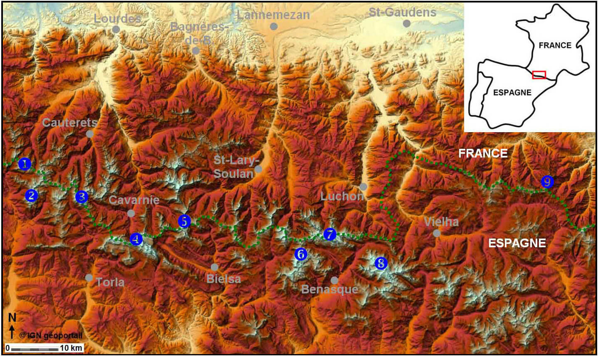

# Un préliminaire s’impose : la définition de « glacier »

La définition officielle est simple, puisqu’un glacier est « un stock d’eau solide permanent à l’échelle humaine ». C’est donc essentiellement le critère de temps qui est pris en compte. Une masse de glace ayant au moins l’âge d’un homme est un glacier et ceci quelle que soit sa taille. Dans les Pyrénées, de façon arbitraire, l’inventaire ne considère que les glaciers supérieurs à 2 hectares. De plus, ils sont classés en 2 catégories :

## Glaciers véritables

Permanence à l’échelle humaine, présence d’éléments (crevasses) caractéristiques d’un écoulement glaciaire,

## Glaciers résiduels

Permanence à l’échelle humaine, autrefois des glaciers véritables mais aujourd’hui dépourvus de signes d’écoulement.

# Localisation

Les massifs supportant encore des glaciers se situent, d’Ouest en Est, entre le Balaïtous et le Mont Valier. On comptabilise au total 9 massifs, dont 5 se localisent en France (Balaïtous, Vignemale, Munia, Perdiguère et Mont Valier), 3 se situent en Espagne (Enfer, Posets et Aneto) et 1 est transfrontalier, il s’agit du massif de Gavarnie-Mont Perdu.

{: .mw-100}

|-----------------+------------|
| Massif | Glacier    |
|-----------------|:-----------|
| 1. Balaïtous (3144m)  | Las Néous (FR) |
| 2. Enfer (3082m)  | Enfer central (ES) |
| 3. Vignemale (3298m)  | Ossoue, Oulettes, Petit Vignemale (FR) |
| 4. Gavarnie - Mont Perdu (3355m)  | Gabiétous, Taillon, Pailla ouest, Pailla est, Astazou (FR) Cylindre, Mont Perdu (ES) |
| 5. Munia (3133m) | Munia, Barroude (FR) |
| 6. Posets (3375m) | Llardana, Paoules, Posets (ES) |
| 7. Perdiguère (3222m) | Gourgs Blancs, Seil de la Baque ouest, Seil de la Baque est, Portillon d'Oô, Boum (FR) |
| 8. Aneto (3404m) | Maladeta, Aneto, Barrancs, Tempêtes (ES) |
| 9. Mont Valier (2838m) | Mont Valier (FR) |
|-----------------+------------|
{: .table }

## Inventaire en 2016

Selon la définition précédemment établie, **25 glaciers** ont été inventoriés au sein des **9 massifs**. **18** d’entre eux sont classés dans la catégorie des **« véritables »**, c’est à dire présentant des crevasses. À noter que les glaciers sont plus nombreux sur le versant français, mais plus grands dans les Pyrénées espagnoles.

{: .mw-100}

| Massif                | Glacier           | Catégorie     | Surface (ha)  | Total massif (ha)     | Rang surface  | Exposition    |
|-------------------    |-----------------  |-------------  |-------------- |-------------------    |-------------- |------------   |
| Balaïtous (3144m)     | Las Néous         | véritable     | 3             | 3                     |               | E             |
| *Enfer (3082m)*       | *Enfer Central*   | *véritable*   | 5,5           | 5,5                   |               | N             |
|                       |                   |               |               |                       |               |               |
{: .table}

## Evolution récente

De 1550 à 1850, on note une période de « mini glaciation » appelée Petit Age Glaciaire correspondant à un faible refroidissement du climat de la Terre. Celui-ci entraîna une avancée des glaciers des Pyrénées comme ceux des Alpes et des autres massifs englacés de la planète. Les moraines frontales et latérales « fraîches » présentes en aval des glaciers actuels sont les témoins de cette période.

Depuis la fin de cette période de refroidissement, c’est un retrait généralisé qui est observé, conséquence d’un réchauffement du climat. Cependant, le recul a été entrecoupé de périodes de stagnation des fronts glaciaires parfois même de mini avancées. Les principales se seraient produites dans les années 1890, 1920, 1945 et 1970.

<table class="table">
  <caption>
  La surface englacée pyrénéenne depuis 1850
  </caption>
  <thead>
    <tr>
      <th>Année</th>
      <th>Surface (en km²)</th>
      <th>Auteurs</th>
    </tr>
  </thead>
  <tbody>
    <tr>
      <td>1850</td>
      <td>23</td>
      <td>J. San Roman, J. Luis Piedrafita, P. René</td>
    </tr>
    <tr>
      <td>1950</td>
      <td>12,8</td>
      <td>IGN + extrapolation P. René</td>
    </tr>
    <tr>
      <td>1985</td>
      <td>9,5</td>
      <td>D. Serrat, J. Ventura, E. Martinez de Pison</td>
    </tr>
    <tr>
      <td>1991</td>
      <td>9,2</td>
      <td>E. Martinez de Pison + extrapolation P. René</td>
    </tr>
    <tr>
      <td>1994</td>
      <td>8,3</td>
      <td>E. Martinez de Pison + extrapolation P. René</td>
    </tr>
    <tr>
      <td>1998</td>
      <td>5,5</td>
      <td>E. Martinez de Pison + extrapolation P. René</td>
    </tr>
    <tr>
      <td>2000</td>
      <td>5</td>
      <td>E. Martinez de Pison, P. René</td>
    </tr>
    <tr>
      <td>2002</td>
      <td>4,7</td>
      <td>E. Martinez de Pison + extrapolation P. René</td>
    </tr>
    <tr>
      <td>2007</td>
      <td>3,5</td>
      <td>M. Arenillas, P. René</td>
    </tr>
    <tr>
      <td>2011</td>
      <td>3</td>
      <td>R. Marti</td>
    </tr>
    <tr>
      <td>2016</td>
      <td>2,6</td>
      <td>I. Rico et al. et P. René</td>
    </tr>
  </tbody>
</table>

## Perspective

A partir des données de surfaces globales des glaces pyrénéennes (cf. tableau « Evolution récente… »), on peut réaliser un graphique dont la courbe de tendance prévoit l’extinction des glaciers pour les environs de 2050.

"){: .mw-100}
{: .text-center}

Il est important de préciser que cette perspective artisanale est aucunement une certitude. Néanmoins, voici en image ce qu’une telle évolution pourrait donner :

  

  Le Mont Perdu en 2000
   
  
  
  
  

  

  Le Mont Perdu en 2050 ?
   
  
  
  
  

