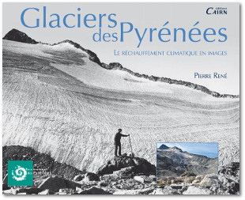

{: .mw-100}
{: .text-center}

Tout le monde connaît l’existence de glaciers dans les Alpes. Ce que l’on sait moins, c’est qu’il existe aussi des glaciers dans les Pyrénées. Et qu’à l’instar de leurs voisins alpins, ils sont fortement menacés.
Ce livre est le premier ouvrage français qui leur est consacré. Très richement illustré de photographies anciennes et récentes mises en regard le plus souvent sous forme de diptyque, il propose au lecteur de suivre l’évolution de ces neiges prétendument éternelles, à quelque 100 ans de distance. D’où la précision du sous-titre : en images.
Depuis la fin du XVIIIe siècle, ils passionnent. Les pyrénéistes, ces explorateurs érudits, savants et écrivains, voyaient en eux aussi bien un objet de défi dans leurs ascensions que d’étude. Au XIXe siècle, grâce à la photographie, les témoignages de leur présence sur les plus hauts sommets de la chaîne se multiplient.
C’est d’une histoire récente des glaciers pyrénéens qu’il s’agit, d’une « micro-histoire » à l’échelle des temps géologiques. Se fondant sur les témoignages des scientifiques qui se sont penchés sur leur cas depuis près de deux siècles, et comparant ces données à ses propres observations de terrain, Pierre René dresse un portrait des principaux d’entre eux, avant qu’il ne soit trop tard.

Parce que la glaciologie demeure une science mal connue du grand public, l’auteur a fait le choix de présenter les glaciers selon un classement qui aidera à mieux suivre dans le même temps les progrès d’investigation effectués par cette discipline encore jeune.

Si l’étude d’un glacier est souvent l’occasion pour l’auteur de développer dans un encadré un point précis de sa mécanique et de ses effets, cet ouvrage ne manque pas d’aborder plus généralement le monde de la montagne pyrénéenne. Une large place est alors donnée, par des citations, à ces écrivains qui ont dédié leur vie et leur plume à chanter les beautés de ses cimes et qui en ont, pour une grande part, fait l’histoire.

Il semblerait que le réchauffement climatique, dont les glaciers sont les victimes les plus évidentes, soit en grande partie dû aux activités humaines. L’auteur ne se contente pas de constater leur disparition, il souhaiterait aussi faire prendre conscience, par ce livre, de l’urgence qu’il y a à changer nos modes de vie.

## Comment vous le procurer ?

Il est vendu à la modique somme de **30 €** (+ 5€ pour les frais de port)

Envoyez votre règlement à l’association à l’adresse suivante (sans oublier de préciser vos coordonnées) :
<address>
<strong>
Association Moraine
</strong>
 
Village 
31110 Cathervielle 
France
</address>

